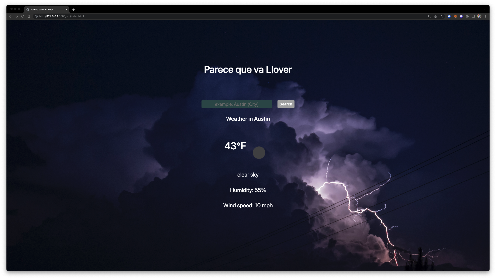

# Parece Que Va Llover


Hello, this is a weather application that the user can search by city and the application will display the current weather of the searched city. Parece que va a llover will display the current temperature in °F and a brief description of the weather, humidity and wind speed in mph. The application uses an api key to retrieve the weather information from OpenWeather API website.  


## API Reference

OpenWeather API is a Weather API service where developers can signup and get an api key to be able to retrieve data from the website and into your applictaion.


| Parameter | Type     | Description                |
| :-------- | :------- | :------------------------- |
| `apikey` | `string` | **Required**. Your API key |

#### API Website

```http
  https://openweathermap.org/
```


## Run Locally

Clone the project

```bash
  git clone git@github.com:Leftjose/bug-free-octo-fiesta.git
```

Go to the project directory

```bash
  cd my-project
```

Install dependencies

```bash
  npm i bootstrap
```

Start the server

```bash
  npm run start
```


## Demo

link to demo
https://drive.google.com/file/d/1vadPQCR3DolkCPWNu6KhV_-MbkrJ5v71/view?usp=sharing

## Features

- Large Text (Accessibility)
- Fullscreen mode
- Mobile friendly


## Roadmap

- Integrate a button to switch from C to F or F to C for travelers to use 
- Integrate google sugestions for correct City, State and Country while searching 
- Store History for users to reference back to
- Add 7 day forecast 
- Add sunrise and sunset 
- Deploy to Netlify with Severless Functions to Hide API keys


## Screenshots



